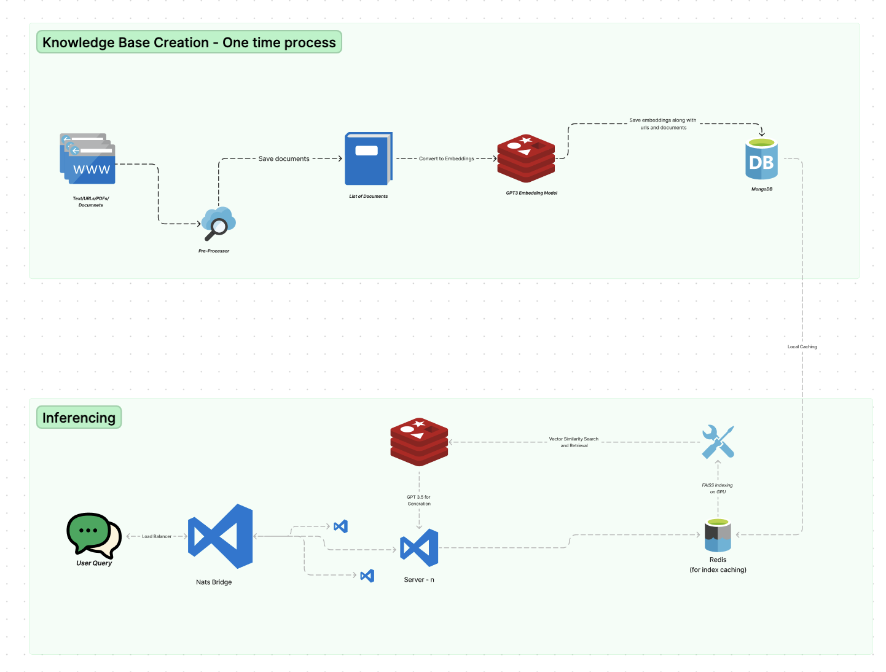

# RAG-QnA

This implementation of Knowledge Base QnA uses open-ai api. Export your api key using 
```
export OPENAI_API_KEY=<apikey>
```

## Running the server and client
You can run the server and client by following these steps :-

Server
```
cd app/
python3 server.py
```
Client
```
cd app/
python3 server.py
```

## System Design
